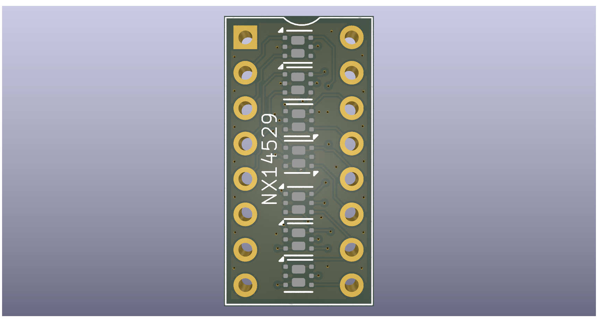

# MC14529 Replacement #

This repository contains the design for a CPLD based
replacement for the long obsolete MC14529 analog
multiplexer. The design is intended only to act as a
substitute in the Dragon 32/64 computers.

## Limitations ##

The original MC14529 can act a 8:1 multiplexer which ties
the two output pins together. It can also place the two
output pins in a high impedance state.

In both cases these configurations are limited in this 
design to suit the specific use-case for the Dragon.

1. The high impedance state is not implemented
2. The two output pins are only correct when the X
inputs are selected, if the Y inputs are selected the 
result will still be two independant outputs

## Design ##

The design is based around the Renesas SLG46824 CPLD.
This is a 3mm x 2mm device (about the size of a 1/4W
leaded resistor). The CPLD reproduces the truth table
of the original device.

The actual multiplexing is performed by an array of
LS74LVC1G3157 analog SPDT switches. These are available
in very small packages allowing seven of them to be
fitted in the available space.

The board design must retain the footprint of a DIP-16
device and provides the most significant design constraint.

## License ##

This project is licensed under creative commons CC-BY-SA 4.0
